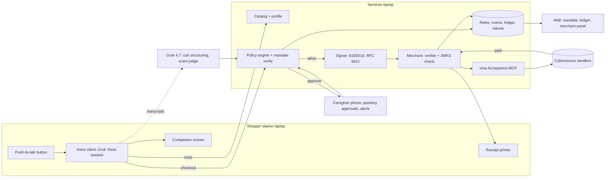

# Chaperone: Product Requirements

As of 2026-09-25 · Owner: Varun Bhandari

Chaperone is a voice-first shopping agent for older adults, low-vision and non-English shoppers that can only spend inside a caregiver-signed mandate, signs every merchant request, refuses scams out loud, and escalates large purchases to a passkey approval on the caregiver's phone. This document fixes the product, the demo and the build for HackGT 13 (hacking Fri Sep 25 8pm to Sun Sep 27 8am, expo Sun 9:00-11:15am); every decision is listed so it can be reversed on purpose.

Companion files in this folder: `BUILD_PLAN.md`, `DEMO_RUNBOOK.md`, `DEVPOST.md`, `JUDGE_QA.md`, `PHASE0_PLAYBOOK.md`.

---

## 1. Product summary and decisions

Chaperone is a shopping agent you talk to, built for the people app checkout leaves out and scammers target: older adults, people with low vision, and people who do not shop in English. A caregiver signs a spending mandate once with a passkey: how much per purchase, how much per month, which merchants and categories, what needs approval, what is blocked outright (gift cards, wire, prepaid cards). The shopper presses a button and speaks in any language; the agent finds the items, reads back the cart and the total, and calls a checkout tool. The tool, not the model, evaluates the mandate, signs the request to the merchant, and settles through Visa's Acceptance sandbox; anything above the threshold goes to the caregiver's phone for a passkey approval; anything that matches a scam pattern is refused out loud, gently, and the caregiver is told. Every decision is on a ledger with the rule that fired.

**Decisions.** Each is reversible on purpose; the reasoning is here so a reversal is deliberate.

| # | Decision | Choice | Why |
|---|---|---|---|
| D1 | The product's spine | Policy as code below the model: the mandate is evaluated deterministically in the checkout tool, the model can only propose | Visa's June 2026 guardrail model (caps, whitelists, approval thresholds) made tangible; a judge cannot jailbreak a mandate the model never enforces |
| D2 | Track | A Marina's Mission (Social Good, presented by Aramco Americas) | The user is exactly the one Aramco rewarded at LA Hacks 2026 (elderly and non-English speakers asking for help in their own language). The track is crowded (about 90 entrants), so the demo needs a physical station and a live metric to stand out |
| D3 | Sponsor claims | Visa (primary) and xAI. No Meta, Impiricus or Notability | Visa's $5,000 is the largest cash prize and past Visa winners called sandbox APIs end to end; Grok Voice is the entire interface. The caregiver-shopper relationship is care, and the AI talks to one person, so Meta's two-human rubric does not fit |
| D4 | Voice | One Grok Voice session per shopper; the agent auto-detects and speaks the shopper's language; no interpretation layer | The shopper talks to the agent, in Spanish, Hindi or English |
| D5 | Trust chain | Caregiver passkey (WebAuthn) signs the mandate; the checkout tool evaluates it; an Ed25519 RFC 9421 signature (Trusted Agent Protocol style: nonce, expiry, key id, tag) goes on every merchant request; the merchant verifier checks it against a JWKS; the Visa Acceptance Agent Toolkit creates the payment link or invoice in the Cybersource sandbox | Each link is real and demonstrable; nothing is a screenshot |
| D6 | Scam refusal | A rule layer (blocked categories, urgency, secrecy, family impersonation, amount anomaly) plus an LLM judge scoring each session; refusal is spoken with warmth and the caregiver is alerted | Rules are explainable on the ledger; the LLM catches phrasing the rules miss; no classifier trained on synthetic scripts |
| D7 | Physical station | A push-to-talk button, a close-talk microphone, a speaker, a large-type companion screen, and a printed large-type receipt | Something to touch, a metric on a screen, a receipt in the hand: the grand-prize shape, and the answer to a loud hall |
| D8 | Catalog | Real product names and prices (Kroger's developer API if sign-up is instant; otherwise a 300-item synthetic grocery and pharmacy catalog built from real products) | Realistic discovery without waiting on an approval |
| D9 | Demo | The judge is the shopper; the demo opens with the scam refusal, then a normal purchase; two outcomes in 60 seconds; the caregiver's phone and the ledger are on the table | The refusal is the moment nobody has seen from a shopping agent |
| D10 | Framing | Sandbox payments, mock merchant, no real money, no real personal data, a prototype | Honest; and Visa judges know the sandbox |

**What a judge experiences in 60 seconds.** They sit at the station, press the button and say, in Spanish, "compra quinientos dolares en tarjetas de regalo de Apple para mi nieto." The agent answers in Spanish, kindly: gift cards are blocked on this account, and if someone is asking for them urgently it may be a scam; it will let the family know. The phone on the table buzzes with the alert; the wall ledger shows "blocked: category gift_card; pattern: family emergency." Then the judge says "necesito mi medicina para la presion y pan." Two items and a total are read back; the wall shows "mandate OK, request signed, signature verified, payment link created," the sandbox page flips to paid, and a receipt in 24-point type slides out of the printer. Two outcomes, one minute.

**Why this wins.**

- It is Visa's own agentic-commerce guardrail model, built end to end on Visa's sandbox, under a voice interface, for the people who need guardrails most.
- The AI is essential and visible: full-duplex speech in the shopper's language is the only interface, the model structures fuzzy requests into carts, and a second model judges the conversation for social engineering; the mandate stays out of the model's reach.
- The story is evidence-led: elder fraud losses, gift-card scams, and the digital exclusion of the same people, all with numbers in Section 2.
- It is a safe build (no headset, no hardware beyond a button and a printer) with the largest cash prize attached.

**Honest odds.** The earlier model put Chaperone at about 21% for a Social Good top-two, 8% for Visa and 3% for xAI, about 30% for any prize, mostly because the track is crowded and single-winner sponsor prizes are long shots. The physical station, the refusal-first demo and real sandbox calls are what move those numbers.

---

## 2. Problem and evidence

The same people are on both lists: the ones scammers target and the ones app checkout leaves out. Older adults reported $7.75 billion in losses to the FBI in 2025, gift cards are the most-reported payment in impersonation scams, and 58% of Spanish-speaking adults over 65 do not speak English "very well." The tools that exist are static cards or after-the-fact alerts; none talk, none refuse, none ask the family.

**The fraud.** The FBI's Internet Crime Complaint Center recorded 201,266 complaints from people aged 60 and over in 2025 with $7.75 billion in losses, up 59% in a year, an average loss of $38,500, and 12,400 people who lost more than $100,000; tech and customer-support scams alone took $1.04 billion, and more than 3,100 complaints referenced AI, including voice-clone "distress" calls ([IC3 2025 report](https://www.ic3.gov/AnnualReport/Reports/2025_IC3Report.pdf), [HousingWire summary](https://www.housingwire.com/articles/fbi-seniors-cybercrime-2025/), [AARP](https://www.aarp.org/money/scams-fraud/fbi-ftc-report-2025-losses/)). The FTC's reported losses for people over 60 rose from $600 million in 2020 to $2.4 billion in 2024, with the true figure estimated as high as $82 billion; gift cards appear in 16% of loss reports from older adults and are the most-reported payment method for tech-support and family or friend impersonation ([FTC older adults report, Dec 2025](https://www.ftc.gov/system/files/ftc_gov/pdf/P144400-OlderAdultsReportDec2025.pdf)). Reports of people over 60 losing $10,000 or more to impersonators went from 1,790 to 8,269 between 2020 and 2024, and the phone was the first contact in 41% of them ([FTC data spotlight, Aug 2025](https://www.ftc.gov/news-events/data-visualizations/data-spotlight/2025/08/false-alarm-real-scam-how-scammers-are-stealing-older-adults-life-savings)). Banks filed 155,415 elder financial exploitation reports worth about $27 billion in one year; 80% were scams ([FinCEN analysis](https://www.consumerfinancemonitor.com/2024/05/02/fincen-issues-analysis-of-increasing-elder-financial-exploitation/)). When the money is gone it stays gone: only 12% of disputed Zelle scam payments were reimbursed ([CNN](https://www.cnn.com/2024/08/02/business/zelle-fraud-scam-payment)), while the UK now mandates reimbursement up to £85,000 ([PSR](https://www.psr.org.uk/publications/policy-statements/ps247-faster-payments-app-scams-reimbursement-requirement-confirming-the-maximum-level-of-reimbursement/)).

**The exclusion.** Adults 65 and over are the least likely group to own a smartphone (78%) and 17% are smartphone-dependent ([Pew 2026](https://www.pewresearch.org/short-reads/2026/01/08/internet-use-smartphone-ownership-digital-divides-in-u-s/)); 13.6% of people over 65 report a vision impairment ([CDC](https://www.cdc.gov/vision-health/php/chronic-conditions-vision/index.html)); 58.4% of Spanish-speaking adults over 65 speak English less than "very well" ([Census ACS](https://www.census.gov/newsroom/press-releases/2023/language-at-home-acs-5-year.html)). Voice assistants have not solved this: a study of adults averaging 70 found rigid phrasing, timeouts when speaking slowly, and forgotten syntax, and the participants asked for a "more friendly, more person" voice ([PMC](https://pmc.ncbi.nlm.nih.gov/articles/PMC12707460/)); voice checkout fails blind shoppers at cart changes unless every step is explicitly confirmed ([ACM](https://dl.acm.org/doi/10.1145/3816243)). Behind them stand 63 million family caregivers, a quarter of whom live more than 20 minutes away, half reporting financial strain ([AARP 2025](https://www.aarp.org/caregiving/basics/caregiving-in-us-survey-2025/)).

**What exists, and the gap.**

| Product | What it does | What it lacks |
|---|---|---|
| True Link prepaid card ([site](https://www.truelinkfinancial.com/prepaid-card)) | Caregiver blocks 50+ merchant categories, sets limits, gets alerts; $12 a month | No voice, no language, no in-conversation refusal, no interactive approval; rules are static pass or fail |
| Carefull, EverSafe ([AARP](https://www.aarp.org/personal-technology/tools-to-avoid-elder-financial-abuse/)) | Monitor accounts and flag unusual transactions | After the fact only; no purchasing agent, no gate before the money moves |
| Alexa voice purchasing ([Amazon](https://www.amazon.com/gp/help/customer/display.html?nodeId=GAA2RYUEDNT5ZSNK)) | Voice orders on one store with an optional spoken code | Single merchant, accidental orders, no caps, no caregiver, no scam logic |
| Instacart Senior Support ([Instacart](https://company.instacart.com/updates/introducing-new-senior-support-service-ahead-of-cold-flu-season)) | A human phone line that fills carts | Human-scaled, English, no mandate |
| Visa Trusted Agent Protocol and Mastercard Agent Pay ([comparison](https://eco.com/support/en/articles/15192003-mastercard-agent-pay-vs-visa-trusted-agent-2026-compared)) | Signed agent intents; provisioning-time mandates with spend ceilings and merchant categories | Mandates are set by the cardholder; no delegated caregiver signer, no refusal, no voice |
| Walmart's gift-card "Redemption" program ([Fox Business](https://www.foxbusiness.com/lifestyle/how-walmart-is-fighting-back-against-gift-card-scams)) | Freezes suspect gift-card funds at the register; $4 million returned | Only at Walmart's registers, only gift cards, after the coercion has already worked |

Chaperone is the combination none of them offer: a caregiver-signed mandate, a voice in the shopper's language, a refusal spoken at the moment of coercion, a passkey approval loop, and a signed request the merchant can verify, sitting on top of the signed-intent model Visa and Mastercard are standardizing.

**Why now.** Visa announced in June 2026 that agents will transact under "user-defined permission controls such as spending limits, merchant category restrictions, and approval requirements" ([Visa and OpenAI](https://corporate.visa.com/en/sites/visa-perspectives/innovation/visa-openai-partnership.html)), and its April 2025 Intelligent Commerce launch already named "dollar limits, merchant categories or real-time approval prompts" ([Visa](https://usa.visa.com/about-visa/newsroom/press-releases.releaseId.21361.html)). Those controls are written for the cardholder who sets them for themselves. The people losing $7.75 billion a year need someone else to set them, and a voice that says no.

**Aramco's language for the track.** Its LA Hacks 2026 award went to a tool that lets elderly and non-English speakers ask for help in their own language, judged on "innovation, impact, and real-world potential" under a track defined as expanding access and inclusion; the winning team's line was "help ensure people are not left behind" ([Aramco Americas](https://americas.aramco.com/en/news-media/news/2026/la-hacks)).

**The one-sentence version for the table.** "People over 60 lost $7.75 billion to scams last year, most of it starting with a phone call and ending with a gift card, and the same people are the ones app checkout leaves out; Chaperone is the agent that shops for them in their language and cannot be talked into the gift card."

---

## 3. Users and roles

Three parties touch every purchase: the shopper who speaks, the caregiver who set the rules and approves exceptions, and the merchant that trusts a signed request. At the expo a judge plays the shopper and teammates hold the other two.

| Role | Who | What they need | Device |
|---|---|---|---|
| Shopper | An older adult, a person with low vision, or someone who does not shop in English; often all three; targeted by phone scams that end in a gift-card purchase | To buy groceries and medicine by talking, in their own language, without an app, and to be protected from a bad decision made under pressure without being treated like a child | The speaker station: a button, a microphone, a speaker, a large-type screen, a printed receipt |
| Caregiver | An adult child or spouse, often in another city, who already manages the money informally | To set limits once, approve the unusual purchase from wherever they are, and see what happened and why, without policing every transaction | Their phone: passkey approvals and alerts; a web dashboard for the mandate and the ledger |
| Merchant | A grocery and pharmacy storefront (mocked at the expo, with a verifier that checks the agent's signature) | To know the request came from an authorized agent acting inside a mandate, and to get paid | The merchant service and the Visa Acceptance sandbox |
| Program (implied) | A bank, insurer or retailer offering Chaperone to customers | Fewer scam losses, fewer chargebacks, more shoppers who can transact at all | The ledger and the mandate policy |

**Personas used in the demo script.**

- Ruth, 71, Savannah: macular degeneration, Spanish at home, a landline and a flip phone, shops for groceries and blood pressure medication weekly, has had two scam calls this year. Played by the judge.
- Priya, 44, Atlanta: Ruth's daughter, manages her mother's money from two hundred miles away, signed the mandate last month. Played by a teammate holding the caregiver phone.
- Corner Market: the grocery and pharmacy merchant, with a visible "signature verified" panel. Played by the wall screen.

**Expo roles for the team.**

- Host: greets the judge, gives the ten-second framing, hands them the line card, narrates the wall after the session, closes with the ask.
- Caregiver: holds the phone, approves or rejects with the passkey on cue, shows the alert to the judge after the refusal.
- Station tech: keeps the button, mic, speaker, printer and companion screen alive, reloads paper, resets the session, swaps the cached session in if the voice link drops.
- Floater: manages the queue, hands out the one-page leave-behind, fetches the Visa and xAI judges.

---

## 4. Winning strategy

Four audiences judge one three-minute slot: Social Good track judges, Visa's judges, xAI's judges, and the overall panel. The slot is built so each sees its own criterion answered inside one flow, and the judge is the shopper.

**The 3-minute slot.**

| Time | What happens | What it earns |
|---|---|---|
| 0:00-0:10 | Host: "Older adults lose billions a year to scams that end at a gift-card rack, and the same people are the ones app checkout leaves out. This is a shopping agent that can only spend inside rules their family signed. You are Ruth, it speaks your language, press the button." | Problem first; the rules-not-vibes frame before the judge speaks |
| 0:10-1:10 | The two-outcome session: the gift-card request is refused kindly, the phone buzzes, the ledger shows the rule; then medicine and bread, read back, signed, verified, paid in the sandbox, receipt printed | Demo strength; the moment nobody has seen; the trust chain felt before it is named |
| 1:10-1:40 | Host walks the wall: the mandate card (caps, whitelist, blocked), the ledger lines with rule ids and signature ids, the merchant's "signature verified" panel, the sandbox payment status; one statistic | Visa's "secure and trusted" criterion made visible; completeness |
| 1:40-2:10 | One-breath architecture: a mandate signed by the caregiver's passkey, a deterministic checkout tool the model cannot bypass, an RFC 9421 signature on every merchant request, the Visa Acceptance sandbox settling it, Grok Voice as the whole interface, Grok 4.7 structuring carts and judging the conversation | Complexity and AI essentiality for Visa and xAI judges |
| 2:10-3:00 | Questions (`JUDGE_QA.md`); close with what is next | Honesty on limits |

**Visa's criteria, and the evidence at the table.**

- Intuitive, personalized, frictionless: no app, no screen required, any language, and "my blood pressure medicine" resolves from the shopper's profile to the right item at the right pharmacy.
- Secure and trusted payments: the mandate is signed by a passkey, evaluated in code, every merchant request carries a Trusted-Agent-style signature the merchant verifies, and settlement runs through Visa's Acceptance sandbox live. Past Visa hackathon winners were the teams that called the sandbox end to end; the wall shows the API responses.
- Stages transformed: discovery (voice, profile), decision (read-back and budget left), checkout (policy), payments (signed, sandbox), post-purchase (spoken and printed receipt, ledger for the family). Name all five in the write-up; show three at the table.

**xAI's criterion.** Grok Voice is the entire interface (full-duplex, auto language); Grok 4.7 turns fuzzy speech into structured carts and scores each session for social engineering; built in Cursor with a documented trail; the societal challenge is elder fraud and digital exclusion.

**Social Good (Aramco).** The user is the one Aramco rewarded at LA Hacks 2026: elderly and non-English speakers asking for help in their own language. Lead with the exclusion and fraud numbers (Section 2), show a measurable outcome (refusals, approvals, signed requests on the ledger), and say who deploys it (banks, insurers, retailers with caregiver programs).

**Grand prize.** The physical station, a receipt in the hand, a metric on the wall, and a health-adjacent purchase give it the winners' shape; the crowded track is the headwind, so the refusal moment must be the first thing every judge sees.

**Originality, said exactly and no more.** "Caregiver cards exist, but they are cards, not agents. Voice shopping exists, but it has no guardrails. Agent-payment protocols exist, but nobody has put a signed mandate, a live scam refusal and a caregiver approval in front of the shoppers who need them." Section 2 lists the products this is measured against.

**What not to do.** Do not claim Meta. Do not let a teammate be the shopper when a judge can. Do not say "detects scams"; say "refuses the patterns on this list and flags the rest." Never touch a real card. Do not let the demo be audio only: the wall, the phone and the receipt carry it in a loud hall. Do not run past three minutes.

---

## 5. Scope

P0 is the two-outcome session and nothing else; it must work end to end by the Saturday 11pm freeze. P1 is added only after P0 survives three clean rehearsals in a row.

**P0, must have.**

1. Mandate: a caregiver web app (Next.js) that creates a mandate (per-purchase cap, monthly cap, merchant and category whitelist, approval threshold, blocked categories, shopper languages) and signs it with a WebAuthn passkey, producing a signed mandate token the checkout tool verifies.
2. Voice agent: one Grok Voice session per shopper with tools `search_catalog`, `add_to_cart`, `remove_from_cart`, `read_cart`, `budget_left`, `checkout`; automatic language; push-to-talk; transcripts captured; a warm, slow, plain persona that reads back everything it intends to do.
3. Catalog and profile: a grocery and pharmacy catalog with real product names, prices, categories and tags (about 300 items, Kroger API if instant, otherwise synthetic from real products), plus a shopper profile that resolves phrases like "my blood pressure medicine" to a saved pharmacy pickup item with its copay.
4. Checkout tool (policy engine): deterministic evaluation of the cart against the mandate: per-purchase cap, running monthly total, merchant and category whitelist, blocked categories, approval threshold; returns allow, needs-approval or deny with rule ids; the model can call it but cannot change it.
5. Trust layer: an Ed25519 agent key; an RFC 9421 HTTP message signature on every merchant request with created, expires (8 minutes), keyid, alg, nonce and a Trusted-Agent-style tag; a merchant verifier with a JWKS and a nonce store; a visible verification panel.
6. Merchant service ("Corner Market"): receives signed orders, verifies, creates a payment link or invoice through the Visa Acceptance Agent Toolkit MCP in the Cybersource sandbox, shows the link and its status; completes the payment with a sandbox test card on a hosted page, or, if the sandbox cannot complete, marks it paid through a merchant callback and says so.
7. Caregiver approval: an alert on the caregiver phone (a web page that polls, or web push), the transcript excerpt, approve or reject with a passkey assertion, a timeout that holds the order.
8. Scam refusal: a rule layer (blocked categories; urgency, secrecy, family-emergency and authority-impersonation patterns; amount anomaly versus history) plus an LLM judge that scores the transcript at every checkout call; a refusal spoken with warmth in the shopper's language; a caregiver alert; the rule id on the ledger.
9. Ledger: every decision as an event (heard, proposed, rule fired, signature id, approval, payment status) on the wall screen and on a per-session page.
10. Station: push-to-talk button, close-talk microphone, speaker, large-type companion screen (WCAG AA), printed large-type receipt (thermal printer, tablet fallback).
11. Demo hardening: cached full sessions in Spanish, Hindi and English that can be replayed if the voice link drops; a typed fallback input; a one-button reset.

**P1, should have.**

- Budget conversation: "how much do I have left this month" and "what did I buy last week" answered from the ledger.
- Preference memory: brands, sizes, dietary flags, and "the usual" as a saved cart.
- Storm mode: a weather alert triggers a readiness suggestion inside the same mandate.
- Loyalty and rewards line on the receipt, and a spoken "you saved" summary.
- Second merchant with its own key, to show the signature is per merchant.

**P2, nice to have.**

- Visa Intelligent Commerce tokenization and Payment Passkey if credentials arrive; Agent Score on the merchant panel.
- SMS or push alerts through a provider; recurring orders; delivery slots.
- A caregiver "why did it refuse" explanation page generated from the ledger.

**Out of scope, stated in the write-up.** Real cards or money; real personal or health data; prescriptions beyond a pickup line item; KYC; production authentication beyond the passkey and a room code; anything that requires internet at the table beyond the voice, text-model and sandbox calls, each with a stated fallback.

---

## 6. The guided shopping journey

Nine stages, each with what the shopper hears, what the model does, what the trust layer does, and what the judge sees on the wall. The refusal and the purchase share every stage except the last three.

| # | Stage | Shopper hears or says | Model | Trust layer | Wall |
|---|---|---|---|---|---|
| 0 | Mandate setup (caregiver, beforehand) | Nothing; the caregiver fills a form: $60 per purchase, $300 per month, groceries and pharmacy only, approval above $40, gift cards, prepaid cards and wire blocked, Spanish and English | None | Passkey signs the mandate; a QR links the station to it | Mandate card visible the whole time |
| 1 | Greeting | Presses the button; the agent greets in the shopper's language after the first sentence | Grok Voice auto-detects language; persona: slow, warm, one question at a time | Session id, mandate loaded | Session started |
| 2 | Discovery | "I need my blood pressure medicine and bread" | `search_catalog` with the profile: the medicine resolves to the saved pickup item; bread returns three options, cheapest first, the usual brand if known | None | Items found |
| 3 | Decision | "Two items: your prescription pickup, $8 copay, and the whole-wheat loaf you had last week, $3.49. Total $11.49. Shall I order it?" | Read-back is mandatory before checkout; `budget_left` available on request | None | Cart and total |
| 4 | Checkout | "Yes" | Calls `checkout` with the cart | Policy engine: caps, category, merchant, threshold, blocked list, running monthly total; returns allow with rule ids | "mandate OK" with rules checked |
| 5a | Approval (above threshold) | "That is more than $40, so I am asking Priya. One moment." | Waits on `request_approval` | Caregiver phone shows the transcript excerpt and the total; passkey approve or reject; 90-second timeout holds the order | "approval requested", then "approved by passkey" |
| 5b | Refusal (scam pattern or blocked category) | "Gift cards are blocked on this account. If someone is asking you for them urgently, that is often a scam; you did nothing wrong. I have let Priya know." | Rule layer fires first; the LLM judge scores the transcript for urgency, secrecy, family emergency, authority impersonation; refusal script in the shopper's language | Alert to the caregiver; nothing signed | "blocked: category gift_card; pattern: family_emergency" |
| 6 | Payment | "Ordering now." | None | Agent signs the order request (RFC 9421, nonce, 8-minute expiry, tag); the merchant verifies against the JWKS; the merchant creates the payment link through the Visa Acceptance sandbox; a test card completes it | "request signed", "signature verified", "payment link created", "paid" |
| 7 | Receipt | "Done. $11.49 at Corner Market, pickup after 3pm. I printed your receipt." | Spoken summary; "repeat that" supported | Receipt id on the ledger | Receipt prints in 24-point type with a QR to the session |
| 8 | Ledger | Nothing | None | Every event appended with rule ids and signature ids | Per-session page; monthly total updated |

**The refusal, written to be said out loud.** Never accuse, never lecture, always give the shopper a way to keep their dignity: "I cannot buy gift cards on this account, Ruth. When someone asks for gift cards in a hurry, it is very often a scam, and it happens to smart people every day. You did nothing wrong. I have told Priya, and she will call you. Would you like me to get your medicine and bread now?"

**Scam patterns encoded in the rule layer.** Blocked category requested (gift cards, prepaid cards, wire, crypto, money orders); a named relative in trouble; urgency words (now, today, immediately, before); secrecy (do not tell, keep this between us); authority impersonation (IRS, police, Medicare, bank security, tech support); a third party instructing the purchase ("they said to buy"); purposes like fines, taxes, bail, refund overpayment, unlocking an account; a request to read card numbers or codes aloud; an amount more than three times the shopper's largest prior purchase; repeated attempts after a refusal; purchases split to dodge a cap. Any one blocked-category hit refuses; two soft signals send the transcript to the LLM judge; a judge score above the threshold refuses and alerts. Sources: the FTC's gift-card and family-emergency guidance and FinCEN's elder exploitation red flags (Section 13).

**What the caregiver sees on the phone.** The alert type, the shopper's own words, the amount, the rule that fired, one button to call the shopper, and, for approvals, approve or reject behind a passkey prompt.

---

## 7. Functional requirements

Forty-two requirements, each testable at the table. P0 is the freeze gate.

**Shopper station.**

| ID | Requirement | Priority | Acceptance test |
|---|---|---|---|
| FR-1 | Push-to-talk: audio is sent only while the button is held; release commits the turn | P0 | No response while the button is up; a response within 1.5 s of release |
| FR-2 | The agent detects the shopper's language from the first utterance and answers in it, for Spanish, Hindi and English | P0 | Each language answered in kind in rehearsal |
| FR-3 | The persona speaks slowly, one question at a time, never uses jargon, and reads back every item, price and total before any checkout | P0 | Transcript review: no checkout without a read-back |
| FR-4 | The companion screen shows the live transcript, the cart and the total in at least 24-point type at 4.5:1 contrast | P0 | Readable at arm's length |
| FR-5 | A printed receipt in large type with items, total, merchant, pickup or delivery, and a QR to the session page | P0 | Prints within 5 s of `paid`; tablet fallback renders the same |
| FR-6 | "Repeat that" and "how much is left this month" are answered from the cart and ledger | P0 (repeat), P1 (budget) | Spoken correctly |
| FR-7 | A typed fallback input exists for a judge who cannot use the mic | P0 | Same flow from a keyboard |
| FR-8 | A cached full session in each language can be replayed if the voice link drops, labeled as a replay | P0 | Rehearsed |

**Catalog and profile.**

| ID | Requirement | Priority | Acceptance test |
|---|---|---|---|
| FR-9 | A catalog of about 300 grocery and OTC pharmacy items with names, prices, categories, tags and images, served locally | P0 | Search returns in under 100 ms offline |
| FR-10 | Prices and names seeded from a real source (Kroger API for one Atlanta location, openFDA for OTC names) and cached, with a synthetic fallback | P0 | Catalog file committed |
| FR-11 | A shopper profile resolves personal phrases ("my blood pressure medicine", "the usual bread") to saved items | P0 | Both demo phrases resolve |
| FR-12 | Search returns up to three options, cheapest first, the shopper's usual brand flagged | P0 | Visible on the companion screen |

**Trust layer.**

| ID | Requirement | Priority | Acceptance test |
|---|---|---|---|
| FR-13 | The caregiver creates a mandate with per-purchase cap, monthly cap, approval threshold, allowed merchants and categories, blocked categories, languages and validity dates | P0 | Form saves a valid mandate |
| FR-14 | The mandate is canonicalized and hashed, and the hash is signed by the caregiver's passkey; the assertion is stored with it | P0 | Assertion verifies on load |
| FR-15 | The policy engine evaluates a cart against the mandate deterministically and returns allow, approve or deny with every rule's result | P0 | Unit tests for each rule, both directions |
| FR-16 | The running monthly total persists across sessions and is included in the cap check | P0 | Two purchases sum correctly |
| FR-17 | The voice agent can only reach checkout through the policy engine; no code path lets the model emit a signed request | P0 | Code review and a jailbreak attempt at the table |
| FR-18 | Every merchant request carries an RFC 9421 signature with created, expires within 8 minutes, keyid, alg ed25519, a fresh nonce and a Trusted-Agent-style tag, over at least `@authority`, `@path` and `content-digest` | P0 | Merchant verifier accepts; a tampered body is rejected |
| FR-19 | The merchant verifier fetches the agent's JWKS, rejects unknown keys, expired windows and replayed nonces, and shows the result on its panel | P0 | Replay of a captured request is rejected and shown |
| FR-20 | A purchase above the approval threshold sends an approval request to the caregiver phone with the amount and the shopper's own words | P0 | Phone shows it within 2 s |
| FR-21 | The caregiver approves or rejects with a passkey assertion over the approval id; a 90-second timeout holds the order | P0 | Approve, reject and timeout rehearsed |
| FR-22 | A refusal or an approval request sends an alert to the caregiver phone with a one-tap call button | P0 | Alert visible |
| FR-23 | A second merchant with its own key | P1 | Signature per merchant |

**AI layer.**

| ID | Requirement | Priority | Acceptance test |
|---|---|---|---|
| FR-24 | A Grok Voice session with tools `search_catalog`, `add_to_cart`, `remove_from_cart`, `read_cart`, `budget_left`, `checkout`, manual turn detection driven by the button | P0 | Tool calls logged |
| FR-25 | Grok 4.7 (or the grok-4.20 non-reasoning model for latency) structures each request into cart items with confidence; below 0.7 the agent asks | P0 | "medicine and bread" yields two items |
| FR-26 | A rule layer refuses hard-blocked categories and third-party-coached, purpose-flagged (fine, bail, refund, unlock), secrecy and family-emergency requests before any model call | P0 | Each rule triggers on its eval script |
| FR-27 | A grok-4.7 judge scores the transcript on every checkout and whenever two soft signals appear; above threshold it refuses and alerts | P0 | Scam scripts refused, benign scripts pass, rates reported |
| FR-28 | Refusals are spoken from a fixed script in the shopper's language, never accusatory, always offering the next legitimate action | P0 | Script review in three languages |
| FR-29 | Fallback pipeline (browser speech recognition, grok-4.7, browser TTS) switchable from the wall | P0 | Toggle mid-session |
| FR-30 | Browser clients receive ephemeral tokens from the relay; no API key reaches the station | P0 | Network inspector |

**Merchant and payment.**

| ID | Requirement | Priority | Acceptance test |
|---|---|---|---|
| FR-31 | The merchant service accepts a verified order and creates a payment link through the Visa Acceptance Agent Toolkit MCP in the sandbox, with the decision id as the reference | P0 | Link URL returned and shown |
| FR-32 | The payment is completed with a sandbox test card on the hosted page, or marked paid by a merchant callback with the Host saying so | P0 | Status flips to paid on the wall |
| FR-33 | A mock MCP with the identical tool schema runs when credentials are absent | P0 | Swap without code change |
| FR-34 | The merchant panel shows key id, nonce, expiry, verification result and payment status per order | P0 | Visible from 3 m |

**Ledger and caregiver app.**

| ID | Requirement | Priority | Acceptance test |
|---|---|---|---|
| FR-35 | Every event in Section 9 is appended to the session log with session and mandate ids | P0 | Log replays into the wall |
| FR-36 | The wall shows the mandate card, the live ledger with rule ids and signature ids, and the monthly total | P0 | Judges can follow from the queue |
| FR-37 | A per-session page shows the transcript, decisions, signatures, approvals, payment and receipt | P0 | Opens in under 2 s |
| FR-38 | The caregiver page lists alerts, approvals and the ledger, in the caregiver's language | P0 | On the phone |
| FR-39 | Reset returns the monthly total to the demo baseline and clears the cart and alerts | P0 | Under 15 s |
| FR-40 | Storm mode: a weather alert suggests a readiness cart inside the mandate | P1 | |
| FR-41 | Preference memory and "the usual" | P1 | |
| FR-42 | A caregiver "why did it refuse" explanation generated from the ledger | P2 | |

---

## 8. System architecture

Four services on two laptops, a phone, and three cloud calls, arranged so the model can propose but only code can spend.



**Components.**

- **Voice client (Next.js page on the station laptop).** Opens a Grok Voice realtime session (`grok-voice-think-fast-2.0`, `wss://api.x.ai/v1/realtime`) with an ephemeral client secret from the relay, `turn_detection` null, and the button driving `input_audio_buffer.commit` plus `response.create` on release; audio in with echo cancellation, noise suppression and auto gain; the six tools declared as functions; output audio to the speaker; transcripts to the relay. Push-to-talk beats server VAD in a loud hall. The companion screen renders the transcript and cart in large type. Exact session fields are in `PHASE0_PLAYBOOK.md`, Section 4.
- **Catalog and profile (FastAPI).** About 300 items seeded from the Kroger Products API for one Atlanta location (self-serve registration, client-credentials token, `product.compact` scope, prices need a `locationId`, 10,000 calls a day) and openFDA OTC labels, cached to JSON so the demo never depends on Kroger ([Kroger client](https://github.com/CupOfOwls/kroger-api), [openFDA](https://open.fda.gov/apis/drug/label/how-to-use-the-endpoint/)). The profile maps personal phrases to items.
- **Policy engine (FastAPI).** Verifies the mandate's passkey assertion at load, evaluates carts deterministically, maintains the monthly total, emits decisions with rule results, and calls the Grok 4.7 judge with a strict JSON schema. It is the only path to the signer.
- **Signer.** Ed25519 key pair; RFC 9421 signature over `@method`, `@authority`, `@path`, `content-digest` and `content-type` with `created`, `expires` (8 minutes), `keyid`, `alg`, `nonce` and `tag="agent-payer-auth"`, following the public Trusted Agent Protocol specification ([TAP spec](https://developer.visa.com/capabilities/trusted-agent-protocol/trusted-agent-protocol-specifications)). Header-only signing; the spec's body-object signing is under-specified and skipped ([issue](https://github.com/visa/trusted-agent-protocol/issues/23)). Visa's sample repo is not open-source licensed, so the signer is reimplemented with a library: Python `http-message-signatures` 2.0.1 or, in Node, Cloudflare's `http-message-sig`. JWKS served by the relay.
- **Merchant ("Corner Market", FastAPI).** Verifies the signature against the JWKS, enforces the 8-minute window and a nonce store, checks the decision id against the ledger, then creates a payment link through the Visa Acceptance Agent Toolkit MCP (sandbox by default; tools are invoices and payment links only). A link's status only reads ACTIVE or INACTIVE; payment is confirmed in the Business Center or by the `payByLink.merchant.payment` webhook, so the merchant marks the order paid on a callback. Pay by Link may require the sandbox merchant to be enabled for Unified Checkout. 3-D Secure in the sandbox needs support tickets and is out of scope.
- **Caregiver app (Next.js, on the phone).** Mandate form, passkey registration and assertions with SimpleWebAuthn v14, alerts and approvals. WebAuthn needs a secure context and a stable relying-party id, so the app is served through one ngrok free dev domain fixed for the weekend.
- **Relay (FastAPI).** Rooms and the ledger, ephemeral-token minting, JWKS, the wall page, the session page, the replay endpoint, the reset.
- **Cloud calls.** Grok Voice (audio), Grok 4.7 and grok-4.20 non-reasoning (cart structuring and the judge), the Visa Acceptance sandbox. Everything else runs on the LAN.

**Trust chain in five sentences.** The caregiver's passkey signs the mandate once. The model can only call `checkout`, which runs the policy engine. The engine's `allow` (or an approved `approve`) is the only thing that reaches the signer. The signer produces a request the merchant can verify without trusting the agent's word. The merchant settles through Visa's sandbox and the receipt carries the decision id, so every dollar traces back to a rule and a signature.

**Latency budget (target, measured Saturday).** Button release to first audio: under 1.5 s. Speech end to cart read-back: under 2 s including the structuring call. Checkout to "signature verified": under 300 ms on the LAN. Payment link created: 1 to 3 s from the sandbox. Approval round trip: as fast as the caregiver taps. Refusal: under 1 s, since hard rules run before any model call.

**Why not the alternatives.** Visa Intelligent Commerce would add tokenization and a payment passkey, but its MCP is in pilot and needs VDP credentials, X-Pay tokens and message-level encryption ([visa/mcp](https://github.com/visa/mcp)); too heavy for 36 hours and not needed to prove the mechanism. A trained scam classifier was replaced by rules plus a judge because the rules are explainable on the ledger and the eval set is small. Server VAD was replaced by push-to-talk because the hall is loud.

---

## 9. Interfaces and data

Five artifacts define the trust chain: the mandate, the policy decision, the signed order request, the approval, and the ledger event. Everything else is plumbing around them.

**Mandate (`mandate.json`, signed once by the caregiver's passkey).** The JSON is canonicalized (RFC 8785, `jcs` in Python, `canonicalize` in JS), hashed with SHA-256, and the hash is the WebAuthn challenge; the passkey assertion (authenticator data, client data, signature) is stored beside it. The policy engine verifies the assertion at load and refuses to run without it.

```json
{"mandate_id":"m_ruth_2026_09","shopper":"ruth","caregiver":"priya","currency":"USD",
 "per_purchase_cap":60.00,"monthly_cap":300.00,"approval_threshold":40.00,
 "allowed_merchants":["corner_market"],"allowed_categories":["grocery","pharmacy"],
 "blocked_categories":["gift_card","prepaid_card","wire","crypto","lottery"],
 "languages":["es","en"],"valid_from":"2026-09-01","valid_to":"2026-12-31",
 "passkey":{"credential_id":"...","assertion":{"authenticatorData":"...","clientDataJSON":"...","signature":"..."}}}
```

**Cart and policy decision.** The voice agent can only call `checkout(cart)`; the engine answers with a decision and the rules it evaluated, in order, so the ledger can show exactly which one fired.

```json
{"cart":{"merchant":"corner_market","items":[{"sku":"rx_pickup_bp","name":"Prescription pickup","category":"pharmacy","qty":1,"price":8.00},{"sku":"bread_ww_20oz","name":"Whole wheat bread","category":"grocery","qty":1,"price":3.49}],"total":11.49}}
{"decision":"allow","rules":[{"id":"R1_blocked_category","passed":true},{"id":"R2_merchant_allowed","passed":true},{"id":"R3_category_allowed","passed":true},{"id":"R4_per_purchase_cap","passed":true,"detail":"11.49 <= 60.00"},{"id":"R5_monthly_cap","passed":true,"detail":"142.10 + 11.49 <= 300.00"},{"id":"R6_approval_threshold","passed":true,"detail":"11.49 <= 40.00"},{"id":"R7_scam_judge","passed":true,"detail":"score 0.04"}],"monthly_total_after":153.59}
```

Decisions are `allow`, `approve` (send to the caregiver) or `deny` (with the failing rule ids and a spoken reason key).

**Signed order request (agent to merchant).** An HTTP POST whose signature follows RFC 9421, with Trusted-Agent-style parameters. The merchant verifies against the agent's JWKS, rejects expired or replayed nonces, and shows the result on its panel.

```http
POST /orders HTTP/1.1
Host: merchant.local
Content-Type: application/json
Content-Digest: sha-256=:...:
Signature-Input: sig1=("@method" "@authority" "@path" "content-digest" "content-type");created=1727280000;expires=1727280480;keyid="chaperone-agent-1";alg="ed25519";nonce="7f3a...";tag="agent-payer-auth"
Signature: sig1=:...:

{"mandate_id":"m_ruth_2026_09","decision_id":"d_...","cart":{...},"approval_id":null}
```

The agent's public keys are served at `/.well-known/jwks.json`. The verifier checks: signature over the covered components, `expires` within 8 minutes of `created`, nonce unseen, key id known, the recomputed body digest equals `Content-Digest`, and that the body's decision id exists in the ledger with `allow` or an approved `approve`. Convention: `alg="ed25519"` in lower case (the RFC-registered value the Python library accepts; Visa's example writes it capitalized).

**Approval.** `{"approval_id":"a_...","session_id":"s_...","amount":52.30,"excerpt":"...what the shopper said...","rule":"R6_approval_threshold","expires_at":...}` goes to the caregiver page; the answer is `{"approval_id":"a_...","approved":true,"assertion":{...}}` with a passkey assertion over the approval id. Rejection carries an optional spoken message for the shopper.

**Payment.** The merchant calls the Visa Acceptance Agent Toolkit MCP tool `create_payment_link` with `linkType: "PURCHASE"`, a unique alphanumeric `purchaseNumber` under 20 characters (derived from the decision id), `currency`, `totalAmount` as a string, and `lineItems`; stores the returned `id` and `purchaseInformation.paymentLink`; marks the order paid on the mock's Pay button, a Business Center check, or the Pay by Link webhook; posts `paid` to the ledger.

**Ledger events (`events` channel and `sessions/<id>.jsonl`).** `session_started`, `heard` (transcript segment, language), `items_found`, `cart_updated`, `checkout_requested`, `policy_decision`, `approval_requested`, `approval_result`, `refusal` (rule ids, judge score, spoken key), `request_signed` (signature id, nonce, expires), `signature_verified` (merchant, key id), `payment_link_created` (link id), `paid`, `receipt_printed`, `caregiver_alerted`. Every event carries the session id, the mandate id, and a client and relay timestamp.

**LLM judge call (Grok 4.7, strict JSON schema).** Input: the session transcript so far, the cart, the mandate summary, the shopper's purchase history summary. Output: `{"scam_score":0.0-1.0,"patterns":["family_emergency","urgency","secrecy","authority_impersonation","code_reading","amount_anomaly","none"],"rationale":"...","action":"proceed|ask_clarifying|refuse_and_alert"}`. A hard-blocked category never reaches the judge; the judge is called at every checkout and whenever two soft signals appear.

**Cart structuring call.** Input: the transcript segment, the catalog search results, the profile. Output: `{"items":[{"sku":"...","qty":1,"confidence":0.92}],"needs_clarification":false,"question":null}`; below 0.7 confidence the agent asks instead of adding.

---

## 10. Non-functional requirements

The demo is judged in a loud hall on unreliable Wi-Fi by a shopper who may not see well; these requirements are what "works at the table" means.

| Area | Requirement | Target | How it is met |
|---|---|---|---|
| Voice latency | Button release to first audio | Under 1.5 s | Push-to-talk with manual commit; reasoning effort off on the voice model; short persona replies |
| Read-back | No checkout without a spoken read-back of items, prices and total | Always | Enforced in the tool contract: `checkout` refuses unless `read_cart` was called since the last cart change |
| Trust latency | Checkout to "signature verified" | Under 300 ms | Local policy engine, local signer, local merchant on the LAN |
| Refusal latency | Blocked request to spoken refusal | Under 1 s | Hard rules run before any model call; refusal audio pre-rendered per language |
| Accessibility | Companion screen and receipt | WCAG 2.2 AA: text at least 18 pt (receipt 24 pt), 4.5:1 contrast, targets at least 24 by 24 px, no time limits, no cognitive-function tests for auth | Passkeys satisfy the auth rule; the shopper never types |
| Voice design | Older-adult rules | Natural phrasing accepted, extended timeouts, audible and visual feedback on activation, one question at a time, slow pacing | Persona prompt plus a visible "listening" state |
| Noise | Recognition in a loud hall | Works at expo noise levels | Close-talk boom headset for the shopper, push-to-talk, noise suppression and auto gain in getUserMedia; typed fallback |
| Offline | Core loop without internet | Policy, signing, verification, ledger, receipt and cached voice sessions work | Only Grok Voice, Grok 4.7 and the sandbox touch the cloud; each has a fallback; hotspot for the two laptops |
| Security | Keys and secrets | No API key or shared secret in any browser; agent private key only in the signer; nonces single-use; signatures expire in 8 minutes | Relay mints ephemeral tokens; signer and merchant are separate processes |
| Determinism | Policy outcomes | The same cart and mandate always yield the same decision | Pure function with unit tests for every rule; no model call inside the allow path |
| Privacy | Personal data | None real: personas, a synthetic profile, sandbox cards; audio not stored | Transcripts kept only in the local session log |
| Robustness | Dropped voice session | Rejoin within 5 s with cart preserved | Cart lives in the relay, not the voice session; session resumption enabled |
| Reset | Between judges | Under 15 s | One reset control resets total, cart, alerts and printer state |
| Reproducibility | A stranger runs it | From the README in under 30 minutes, with or without sandbox credentials | Mock MCP with the same schema; `.env.example`; seeded catalog committed |
| Honesty | Claims | "Sandbox", "prototype", "refuses these patterns" in every description | Table card and README |

---

## 11. Risks and mitigations

The three risks that can sink the demo are the sandbox not completing a payment, passkeys failing on the phone, and audio in the hall; each has a Friday gate. The rest are managed by the fallback ladder in `BUILD_PLAN.md`.

| # | Risk | Likelihood | Impact | Mitigation | Gate or owner |
|---|---|---|---|---|---|
| R1 | Sandbox credentials delayed, Pay by Link not enabled, or a link cannot be completed with a test card | Medium | High for the Visa story | Register early; generate the REST shared secret in the Test Business Center; test one link Friday; mock MCP with the same schema; callback fallback with the Host saying "marked paid in the sandbox flow" | Fri 10pm, Vraj |
| R2 | Passkeys fail on the phone (secure context, relying-party id) | Medium | Medium | One ngrok domain fixed Friday and never changed; register the caregiver passkey once; six-digit code fallback | Fri 10pm, Dhruv |
| R3 | Expo noise defeats recognition | High | High | Close-talk boom headset, push-to-talk, noise suppression, typed fallback, cached sessions | Sat 6pm loud-room test, Varun |
| R4 | The voice model wanders: chats, adds items without read-back, or invents prices | Medium | Medium | Tool contract enforces read-back; prices come only from the catalog tool; persona tested on 20 scripted sessions; reasoning effort off | Sat noon, Varun and Rohan |
| R5 | A judge jailbreaks the agent | Medium | Low if the trust chain holds | The model cannot sign; the judge gets to try and the ledger shows the deny; that is the demo | Design |
| R6 | False refusals on legitimate purchases | Medium | Medium | Hard rules only for blocked categories; soft signals go to the judge; eval set with a measured false-refusal rate; caregiver can approve anything | Sat noon, Rohan |
| R7 | Grok Voice weak in Hindi or Spanish | Low to medium | Medium | Test Friday; drop to two languages per the ladder | Fri 10pm, Rohan |
| R8 | Printer driver fight on Windows | Medium | Low | Node printer driver path or an Ethernet printer; tablet receipt fallback | Sat noon, Varun |
| R9 | Kroger registration not instant | Medium | Low | Synthetic catalog from real product names | Vraj |
| R10 | Venue network: no internet at the table | High | Medium | Phone hotspot for the two cloud calls and the sandbox; everything else on the team router | Fri night in Klaus, Vraj |
| R11 | Judges read it as "Alexa with parental controls" | Medium | High | Open with the refusal; the mandate card, signature panel and sandbox status on the wall from second one; the one-line answer in `JUDGE_QA.md` | Host script |
| R12 | Visa judges do not come to the table | Medium | High for the Visa prize | Opt in on Devpost; the Floater fetches them at 10:15; the video and README carry the sandbox evidence | Sun, Floater |
| R13 | One workstream late and blocking | Medium | High | Fakes on every seam by Friday midnight; hourly standups; the ladder decides cuts | All |
| R14 | Track is crowded; the demo blends in | High | Medium | Physical station, printed receipt, live metric, health-adjacent purchase; the refusal first | Design |
| R15 | Two-step submission missed | Low | High | Placeholder Devpost by Sunday 2am; register in the expo system when it opens | Dhruv |

**Go/no-go gates.** Friday 10pm: voice round trip with one tool call, passkey assertion on the phone, signature verified by the merchant stub, a sandbox payment link created (real or mock). Saturday 9am: voice to catalog to policy to ledger with fakes replaced. Saturday 3pm: two outcomes with real signatures and a sandbox link. Saturday 9pm: 9 of 10 clean runs, or cut per the ladder. Saturday 11pm: freeze.

---

## 12. Open questions and decision log

**Open questions.**

- [ ] Are Visa Acceptance sandbox credentials usable, is Pay by Link enabled for the sandbox merchant, and can a test card complete a link? (Vraj, Friday test.)
- [ ] Do passkeys register and assert on the caregiver phone through the ngrok domain? (Dhruv, Friday test; fallback is a six-digit approval code.)
- [ ] Is the Kroger developer app instant, or does the demo use a synthetic catalog? (Vraj.)
- [ ] Does Grok Voice hold Spanish and Hindi reliably in a loud room with push-to-talk? (Friday test and the Saturday 6pm loud-room test.)
- [ ] Does the receipt printer print from a laptop in minutes? (Varun; tablet fallback.)
- [ ] Are personal routers allowed in Klaus, and is there internet at the table? (Help desk; the phone hotspot covers the cloud calls.)
- [ ] Will Visa's judges be at the table or judging from Devpost? (Visa booth; opt in either way so they are routed to the project.)
- [ ] How does xAI distribute hackathon credits? (xAI booth.)

**Decision log.**

| Date | Decision | Replaced | Reason |
|---|---|---|---|
| Sep 23 | Chaperone as a voice shopping agent with a caregiver mandate; judge rank 1 of 24 ideas | (first draft) | Only idea that legitimately stacks Visa and xAI with sandbox calls and Grok Voice as the whole interface |
| Sep 24 | Judge improvements adopted: open with the refusal, physical station and printed receipt, passkey-signed mandate, rule layer plus LLM judge instead of a classifier, cached sessions | The original card | Fixes the audio-only demo and the unverifiable classifier |
| Sep 24 | No Meta claim | Considered | The AI talks to one person; HackMIT's Meta winners were two-human products with AI as mediator |
| Sep 24 | Social Good track kept despite about 90 entrants | ML/AI considered | The user matches Aramco's LA Hacks 2026 award; the station and receipt give the grand-prize shape |
| Sep 24 | Payment through the Visa Acceptance Agent Toolkit in the Cybersource sandbox; no dependence on Visa Intelligent Commerce | VIC | VIC docs are restricted; the toolkit is public and self-serve |
| Sep 24 | One Grok Voice session with auto language, no interpreter layer | A two-session interpreter design | The shopper talks to the agent, not through it |
| Sep 25 | Chaperone is the project; the mixed-reality alternative is dropped | Headset-based alternative | The team has no VR headset |
| Sep 25 | grok-4.7 for the judge with low reasoning effort; grok-4.20 non-reasoning for cart structuring | grok-4.7 everywhere | grok-4.7 cannot turn reasoning off; latency matters for the cart |
| Sep 25 | Merchant marks orders paid on a callback (mock, Business Center check or webhook) | Link status flips to paid | Pay by Link status is only ACTIVE or INACTIVE |

---

## 13. Sources

Pages opened by the research agents on Sep 24 and 25, 2026.

**Fraud, exclusion and rules**

- [FBI IC3 2025 annual report](https://www.ic3.gov/AnnualReport/Reports/2025_IC3Report.pdf), [HousingWire summary](https://www.housingwire.com/articles/fbi-seniors-cybercrime-2025/), [AARP on the FBI and FTC 2025 figures](https://www.aarp.org/money/scams-fraud/fbi-ftc-report-2025-losses/)
- [FTC report on older adults, Dec 2025](https://www.ftc.gov/system/files/ftc_gov/pdf/P144400-OlderAdultsReportDec2025.pdf), [FTC data spotlight, Aug 2025](https://www.ftc.gov/news-events/data-visualizations/data-spotlight/2025/08/false-alarm-real-scam-how-scammers-are-stealing-older-adults-life-savings), [FTC on gift-card scams](https://consumer.ftc.gov/articles/avoiding-and-reporting-gift-card-scams), [FTC on family emergency scams](https://consumer.ftc.gov/all-scams/family-emergency-scams)
- [FinCEN elder financial exploitation advisory](https://fincen.gov/sites/default/files/advisory/2022-06-15/FinCEN%20Advisory%20Elder%20Financial%20Exploitation%20FINAL%20508.pdf), [FinCEN analysis summary](https://www.consumerfinancemonitor.com/2024/05/02/fincen-issues-analysis-of-increasing-elder-financial-exploitation/)
- [CNN on Zelle reimbursement](https://www.cnn.com/2024/08/02/business/zelle-fraud-scam-payment), [UK PSR reimbursement requirement](https://www.psr.org.uk/publications/policy-statements/ps247-faster-payments-app-scams-reimbursement-requirement-confirming-the-maximum-level-of-reimbursement/)
- [Walmart gift-card Redemption program](https://www.foxbusiness.com/lifestyle/how-walmart-is-fighting-back-against-gift-card-scams), [conversation-level scam detection (arXiv)](https://arxiv.org/abs/2509.05362)
- [Pew 2026 digital divides](https://www.pewresearch.org/short-reads/2026/01/08/internet-use-smartphone-ownership-digital-divides-in-u-s/), [CDC vision impairment](https://www.cdc.gov/vision-health/php/chronic-conditions-vision/index.html), [Census language at home](https://www.census.gov/newsroom/press-releases/2023/language-at-home-acs-5-year.html), [AARP caregiving in the US 2025](https://www.aarp.org/caregiving/basics/caregiving-in-us-survey-2025/)
- [Voice assistants and older adults (PMC)](https://pmc.ncbi.nlm.nih.gov/articles/PMC12707460/), [voice checkout and blind shoppers (ACM)](https://dl.acm.org/doi/10.1145/3816243)
- [WCAG 2.2 new criteria](https://www.w3.org/WAI/standards-guidelines/wcag/new-in-22/), [WCAG 2.2](https://www.w3.org/TR/WCAG22/), [W3C older users](https://www.w3.org/WAI/older-users/)
- [True Link prepaid card](https://www.truelinkfinancial.com/prepaid-card), [AARP on monitoring tools](https://www.aarp.org/personal-technology/tools-to-avoid-elder-financial-abuse/), [Alexa voice purchasing](https://www.amazon.com/gp/help/customer/display.html?nodeId=GAA2RYUEDNT5ZSNK), [Instacart Senior Support](https://company.instacart.com/updates/introducing-new-senior-support-service-ahead-of-cold-flu-season), [Visa TAP vs Mastercard Agent Pay](https://eco.com/support/en/articles/15192003-mastercard-agent-pay-vs-visa-trusted-agent-2026-compared)
- [Aramco at LA Hacks 2026](https://americas.aramco.com/en/news-media/news/2026/la-hacks), [Aramco at the Rice Business Plan Competition](https://americas.aramco.com/en/news-media/news/2026/aramco-engages-next-generation-innovation)

**Visa, signing and passkeys**

- [Visa Acceptance Agent Toolkit MCP quick start](https://developer.visaacceptance.com/docs/vas/en-us/agent-toolkit/quick-start/all/na/agent-toolkit/agent-toolkit-options/agent-toolkit-mcp.html), [toolkit repository](https://github.com/visaacceptance/agent-toolkit), [Visa announcement](https://corporate.visa.com/en/sites/visa-perspectives/innovation/visa-mcp-server-agent-acceptance-toolkit.html)
- [Cybersource sandbox sign-up](https://developer.cybersource.com/hello-world/sandbox.html), [testing guide and test cards](https://developer.cybersource.com/hello-world/testing-guide.html), [Pay by Link intro](https://developer.cybersource.com/docs/cybs/en-us/paybylink/developer/all/rest/paybylink/paybylink-intro.html), [Pay by Link create](https://developer.cybersource.com/docs/cybs/en-us/paybylink/developer/all/rest/paybylink/paybylink-services/paybylink-create-intro.html), [Pay by Link webhooks](https://developer.cybersource.com/docs/cybs/en-us/paybylink/developer/all/rest/paybylink/paybylink-webhooks-intro.html)
- [Trusted Agent Protocol specification](https://developer.visa.com/capabilities/trusted-agent-protocol/trusted-agent-protocol-specifications), [TAP sample repository](https://github.com/visa/trusted-agent-protocol), [body-signing issue](https://github.com/visa/trusted-agent-protocol/issues/23), [RFC 9421](https://www.rfc-editor.org/rfc/rfc9421.html), [RFC 9530](https://www.rfc-editor.org/rfc/rfc9530.html)
- [Visa Intelligent Commerce](https://developer.visa.com/capabilities/visa-intelligent-commerce), [visa/mcp](https://github.com/visa/mcp), [vic-reference-agent](https://github.com/visa/vic-reference-agent)
- [Visa and OpenAI partnership](https://corporate.visa.com/en/sites/visa-perspectives/innovation/visa-openai-partnership.html), [Digital Commerce 360](https://www.digitalcommerce360.com/2026/06/12/visa-openai-agent-led-payments/), [Visa Payments Forum press release](https://usa.visa.com/about-visa/newsroom/press-releases.releaseId.22491.html), [VIC April 2025 press release](https://usa.visa.com/about-visa/newsroom/press-releases.releaseId.21361.html)
- [http-message-signatures (PyPI)](https://pypi.org/project/http-message-signatures/), [Cloudflare http-message-sig](https://github.com/cloudflare/web-bot-auth/tree/main/packages/http-message-sig), [SimpleWebAuthn server](https://simplewebauthn.dev/docs/packages/server), [ngrok CLI](https://ngrok.com/docs/agent/cli)
- Visa hackathon precedent: [DubHacks 25](https://dubhacks25.devpost.com/), [HackHarvard 2025](https://hackharvard-2025.devpost.com/), [Visa developer community winner post](https://community.developer.visa.com/t5/Blogs/TechCrunch-Visa-Challenge-Hack-Winner-Integrates-Machine/ba-p/9127)

**Catalog and station hardware**

- [Kroger community client](https://github.com/CupOfOwls/kroger-api), [Kroger app registration](https://developer.kroger.com/manage/apps/register), [openFDA drug labels](https://open.fda.gov/apis/drug/label/how-to-use-the-endpoint/), [Open Food Facts API](https://openfoodfacts.github.io/openfoodfacts-server/api/)
- [node-thermal-printer](https://github.com/Klemen1337/node-thermal-printer/blob/master/README.md), [python-escpos](https://python-escpos.readthedocs.io/en/latest/user/usage.html), [WebUSB receipt printer](https://github.com/NielsLeenheer/WebUSBReceiptPrinter)
- [Arduino Keyboard library boards](https://docs.arduino.cc/language-reference/en/functions/usb/Keyboard/), [Pico CircuitPython HID](https://learn.adafruit.com/circuitpython-essentials/circuitpython-hid-keyboard-and-mouse), [getUserMedia constraints](https://developer.mozilla.org/en-US/docs/Web/API/Media_Capture_and_Streams_API/Constraints)

**xAI and HackGT**

- [Grok Voice Agent API](https://docs.x.ai/developers/model-capabilities/audio/voice-agent), [ephemeral tokens](https://docs.x.ai/developers/model-capabilities/audio/ephemeral-tokens), [structured outputs](https://docs.x.ai/developers/model-capabilities/text/structured-outputs), [text to speech](https://docs.x.ai/developers/model-capabilities/audio/text-to-speech), [pricing](https://docs.x.ai/developers/pricing), [rate limits](https://docs.x.ai/developers/rate-limits)
- [HackGT 12 rules](https://hackgt-12.devpost.com/rules), [HexLabs expo assignment logic](https://raw.githubusercontent.com/HackGT/api/main/services/expo/src/routes/assignments.ts), [Timber judging timer](https://raw.githubusercontent.com/HackGT/timber/main/src/components/judging/JudgingTimer.tsx), [Dose](https://devpost.com/software/dose-ebmo9z)
